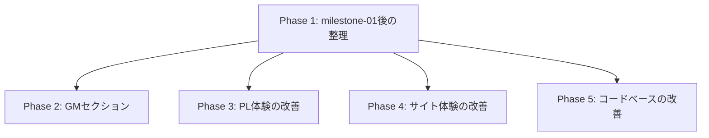

# milestone-02 計画

このファイルはmilestone-02の大まかな計画を管理する。各項目の実装契約は、着手時に作成・承認する個別issueとする。この計画だけを根拠に実装は開始しない。

milestone-01の履歴は `docs/issue/milestone-01/plan.md`、現在のスコープ外項目は `docs/out-of-scope.md` を正本とする。

## 目的

- 初回公開後の運用上の課題を整理する。
- GMが参照・運用できるルールとエネミー情報を追加する。
- PLの用語参照とデータ探索を改善する。
- 既存サイトの読書・保守体験を段階的に改善する。

## Phase 1: milestone-01後の整理

- milestone-02-phase-01-github-issue-archive — GitHub Issue #186
- [ ] `milestone-02-phase-01-todo-resolution` — `docs/TODO.md` の対応方針を整理し、Phase 1で回収する技術的TODOをGate単位で実装する。
- `docs/agent-failure-log.md` の未反映項目を監査し、必要な恒久対応を計画する。

## Phase 2: GMセクション

- GM専用ルールを公開する。
- エネミーガイドを追加する。
- エネミー用のルール・スキル・データの公開方針と表示を整備する。
- コンテンツ構成、ナビゲーション、データ管理、公開範囲を個別issueで確定してから実装する。

## Phase 3: PL体験の改善

- 専用の用語集ページを追加する。
- データとスキルを探すための絞り込みを追加する。
- キャラクターシートの候補行が選択可能であることを視覚的に伝えるdesignを検討する。
- 覚悟から縁へ戻す効果が許可される意図を、ルール本文とスキル効果で明確にする。
- 初期表示で収まらない表の情報設計とresponsive表示を検討する。
- 対象ページ、条件、モバイルでの操作性、検索との役割分担を個別issueで定義する。

## Phase 4: サイト体験の改善

- ページ内目次で、スクロール位置に対応する見出しをハイライトする。
- 対象ページ、アクセシビリティ、既存のPC・モバイル目次との整合を確認する。

## Phase 5: コードベースの改善

- クライアントnative JavaScriptで実装している対話処理を、必要性と静的サイト性を確認したうえでReact Islandへ段階的に移行する。
- 移行対象ごとに、JavaScriptのまま維持する案と比較して判断する。

## 検討・保留

- 個別OGP画像は、作成コストと運用方法を判断できるまで初期スコープ外のままとする。

## 依存関係

## 着手ルール

- 各Phaseの実装は、対象を絞った個別issueを作成し、ユーザー承認後に開始する。
- UI、ページ、Componentを変更するissueでは、実装前にdesign intentと対象VRTを確認する。
- milestone計画のチェックは、人間レビュー後のユーザー指示なしに完了扱いにしない。
