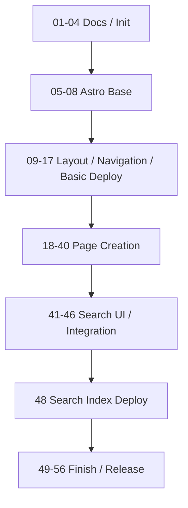

# ネオン・アンダーレルムTRPG ルールサイト開発計画

このファイルは、未完了・進行対象・直近で参照する計画を中心に管理するactive planである。

完了済み計画を退避する場合は、削除せず `docs/plan-done.md` へ移す。退避は、merge後のtracking更新またはユーザーの明示指示で行う。生成AIエージェントは、ユーザー指示なしに完了チェックやdone退避を行わない。

PR merge後の計画更新は `.agents/skills/post-merge-plan-update/SKILL.md` に従う。

## 前提

- 初期開発対象は静的ルールサイト本体とする。
- GMガイド、シナリオ、アクセス解析、ダイスローラー等は初期実装に含めない。Webキャラクターシートは `ex-02-web-character-sheet` に限り初期実装に含める。
- 各branchは原則として単独でbuild可能・review可能な状態でmergeする。
- branch名は `NN-purpose` 形式を基本とする。`ex-NN-purpose` は、ユーザーが特別taskとして指定した場合に限り使用する。
- 1st stepの目的は、ルールサイト公開の初回告知を見た人がなるべく長くサイトを読み、「遊んでみたい」と思えることとする。完了は、初回告知時点でPLが遊ぶ判断と参加準備をするために十分なコンテンツが公開されている状態と定義する。
- Excel本体は `.raw/` 配下でローカル管理し、Git管理しない。
- Git管理するのは、Markdown/MDX本文、サイトコード、変換済みJSON、仕様ドキュメントとする。
- ページ作成フェーズでは、原則として1画面ずつ「データ整備」「必要Component作成」「画面作成」「完成画面スクリーンショットによるdesign更新」まで完了させる。複数ページで同じ入力データまたはComponentを共有する場合は、それらを先行する共通計画にまとめてよい。
- 対象ページがExcelから生成されるデータを要求する場合は、`NN-0` として対象ページまたは関連ページ群のデータ整備計画を追加する。
- 対象ページがExcelから生成されるデータを要求しない場合は、`NN-0` を追加しない。
- 対象ページで必要なComponentが、現在の計画ですでに独立計画として存在していた場合のみ、`NN-1` としてComponent作成計画を追加する。複数ページで共有するComponentは、最初の対象番号の共通計画にまとめてよい。
- 対象ページで新規に独立Component計画が存在しない場合は、`NN-1` を追加しない。
- `NN-1` のComponent作成計画では、実装前にComponent単体のdesignを作成する。
- 対象ページの画面作成は `NN-2` とする。
- `NN-2` では、ユーザーがローカル作業領域の `.raw/contents/SLUG.md` にfrontmatter、Markdown本文、HTMLコメント指示を含むcontents markdownを配置する前提で画面を作成する。
- contents markdownをGoogle Docs上に置く場合は、Markdownソースをプレーンテキストとして保持し、`text/plain` exportで `.raw/contents/*.md` に同期する。
- `.raw/contents/SLUG.md` はコミットしない作業入力である。対応ページでは、ユーザー編集のMarkdown本文とHTMLコメントを、ページ本文・可視の表示構成の正本とする。ユーザーの最新指示、および `AGENTS.md` と該当skill・ruleの安全・workflow規約を除き、issue、requirements、out-of-scope、plan、TODO、design、既存実装より優先する。
- `NN-2` の最後に、完成画面のスクリーンショットをもとにdesign正本を更新する。

---

## Phase 3: ページ作成

- [x] `40-2-404-page` — 404ページを作成する

  - [x] designを生成する
  - [x] `/404.astro` を作成する
  - [ ] `.raw/contents/404.md` のfrontmatter、Markdown本文、HTMLコメント指示をもとに画面を作成する
  - [x] ページが見つからない旨を表示する
  - [x] トップページへのリンクを表示する
  - [x] サイトメニューまたは検索への導線を表示する
  - [x] ページ内目次は表示しない
  - [x] 完成画面のスクリーンショットを取得し、design正本を更新する

- [ ] `41-2-support-page` — オンラインセッションのサポートページを作成する

  - [ ] designを生成する
  - [ ] `/support.mdx` を作成する
  - [ ] `.raw/contents/support.md` のfrontmatter、Markdown本文、HTMLコメント指示をもとに画面を作成する
  - [ ] 本作で多数のダイスを使うことと、オンラインセッションを推奨することを案内する
  - [ ] オンラインセッションの準備と進め方を配置する
  - [ ] 特定ツールを必須にせず、このページ内にダイスローラー、戦闘支援を作らない
  - [ ] 完成画面のスクリーンショットを取得し、design正本を更新する

---

## Phase 4: キャラクター作成

- [ ] `ex-02-web-character-sheet` — ルールを読み込む前でもキャラクターを作って遊んでみたいと思える、Webキャラクターシートを作成する

  - [ ] designを生成する
  - [ ] キャラクター作成に必要な入力項目と手順を定義する
  - [ ] ルールサイト上でキャラクターを作成・編集できるWebキャラクターシートを実装する
  - [ ] 初めて本作に触れるPLが、ルールを通読しなくても試しにキャラクターを作り始められる導線を用意する
  - [ ] スマホで入力・閲覧しやすいことを確認する
  - [ ] 作成したキャラクターを遊ぶために必要な情報が確認できることを確認する
  - [ ] 完成画面のスクリーンショットを取得し、design正本を更新する

---

## Phase 5: 仕上げ・公開

- [ ] `ex-03-hero-layout-stability` — ヒーロー画像の表示遅延によるコンテンツ位置ずれを防ぐ

  - [ ] designを生成する
  - [ ] ヒーロー画像の表示前から表示領域を確保する
  - [ ] 必要に応じて、画像表示中のskeletonを表示する
  - [ ] 画像の表示完了前後で本文コンテンツの位置がずれないことを確認する
  - [ ] 不要なクライアントJSを追加しない
  - [ ] 完成画面のスクリーンショットを取得し、design正本を更新する

- [ ] `49-accessibility-pass` — 最低限アクセシビリティを確認する

  - [ ] 画像altを確認
  - [ ] アイコンリンクのaria-labelを確認
  - [ ] メニュー・検索・目次のEsc挙動を確認
  - [ ] 見出し階層を確認
  - [ ] 色だけに依存した表現がないか確認
  - [ ] タップ領域が極端に小さくないか確認

- [ ] `50-responsive-pass` — レスポンシブ調整を行う

  - [ ] 1024px以上のPCレイアウトを確認
  - [ ] 768px以上1024px未満の表示を確認
  - [ ] 768px未満のスマホレイアウトを確認
  - [ ] スマホヘッダーの下スクロール非表示・上スクロール表示を確認
  - [ ] サイトメニュー、ページ内目次、検索UIがスマホで混同されないことを確認

- [ ] `50-1-vrt-css-regression-guards` — VRT導入時にレイアウトCSS回帰検知を追加する

  - [ ] VRTの実行方針、対象viewport、対象routeを定義する
  - [ ] mobile layoutで意図しない横スクロールが発生していないことを検知する
  - [ ] MobilePageToc sticky headingの背景透過を検知する
  - [ ] TOC非表示対象ページでPageToc / MobilePageTocが表示されないことを検知する
  - [ ] 現在のdesign正本化用スクリーンショット取得testと、将来のVRT検知責務を混同しない

- [ ] `51-performance-pass` — 軽量性を確認する

  - [ ] 不要なクライアントJSを削減
  - [ ] 画像lazy loadingを確認
  - [ ] カード一覧が過剰なクライアント描画に依存していないか確認
  - [ ] 大規模UIライブラリを導入していないことを確認
  - [ ] 外部解析スクリプトを導入していないことを確認

- [ ] `52-github-pages-base-check` — GitHub Pagesサブパス確認を行う

  - [ ] 内部リンク確認
  - [ ] 画像パス確認
  - [ ] CSS/JSパス確認
  - [ ] OGP画像URL確認
  - [ ] Pagefind検索ファイルパス確認
  - [ ] スキルカード個別アンカーの遷移確認
  - [ ] 各アイテムカード個別アンカーの遷移確認
  - [ ] データカード個別アンカーがGitHub Pagesサブパス配下でも壊れないことを確認

- [ ] `53-content-smoke-test` — 主要ページ表示確認を行う

  - [ ] 全ルートにアクセスできる
  - [ ] サイトメニューが機能する
  - [ ] ページ内目次が機能する
  - [ ] 検索が機能する
  - [ ] トップページが表示される
  - [ ] 更新履歴ページが表示される
  - [ ] ルール本文ページが表示される
  - [ ] スキルカードが表示される
  - [ ] 各アイテム種別のカードが表示される
  - [ ] 流儀/生き様テンプレートページが表示される
  - [ ] スキルカードと各アイテムカードに個別アンカーIDが付与されていることを確認する
  - [ ] 本文内リンクまたは検索結果からデータカード個別アンカーへ遷移できることを確認する

- [ ] `54-release-docs` — 公開手順ドキュメントを整備する

  - [ ] `docs/deployment.md` 更新
  - [ ] `README.md` 更新
  - [ ] ローカル開発、データ変換、検証、公開手順を記載
  - [ ] Excel変換がローカル作業であり、CI/CDでは変換済みJSONを使うことを明記

- [ ] `54-1-game-image-generation-policy` — ゲーム画像生成promptの利用方針を整備する

  - [ ] `docs/image-generation/base-prompt.md`を現行hero実績と将来の用途に合わせて改訂する
  - [ ] 画像固有prompt、公式ロゴ、in-world signage、overlay typographyの利用方針と承認手順を決定する
  - [ ] base promptをsampleとして使う範囲と、生成前に画像固有promptで必ず決める事項を記載する

- [ ] `55-initial-release` — 初期公開用最終調整を行う

  - [ ] 初期リリースノートを追加
  - [ ] version tag または初期release名を決定
  - [ ] 初期公開前の最終build確認
  - [ ] 初期スコープ外機能が混入していないことを確認

- [ ] `56-ci-non-main-branches` — main以外でdeployなしCIを回すためのテスト / CIを整備する

  - [ ] branch / pull_request向けのCI workflowをdeploy workflowと分離して作成する
  - [ ] `npm ci` を実行する
  - [ ] `npm run check` を実行する
  - [ ] `npm run build` を実行する
  - [ ] 必要なtestを実行する
  - [ ] GitHub Pages deployは行わない
  - [ ] main以外のbranch / PRで、deployなしに品質確認できることを確認する
  - [ ] docs-only更新、AGENTS / SKILL更新のみの場合にCIを走らせるかどうかの方針を明記する

---

## 初期スコープ外として維持するもの

- [ ] GMガイドは実装しない

- [ ] シナリオ本文は実装しない

- [ ] キャンペーン管理機能は実装しない

- [ ] キャラクター作成ウィザードは実装しない

- [ ] ダイスローラーは実装しない

- [ ] 戦闘シミュレーターは実装しない

- [ ] CMSは実装しない

- [ ] ログイン・認証は実装しない

- [ ] コメント・投稿機能は実装しない

- [ ] DBは導入しない

- [ ] サーバーサイド処理は導入しない

- [ ] 外部検索サービス連携は導入しない

- [ ] PDF自動生成は実装しない

- [ ] PWA対応は実装しない

- [ ] 多言語対応は実装しない

- [ ] 高度な画像最適化は実装しない

- [ ] 高度な一覧フィルタは実装しない

- [ ] 用語集専用ページは実装しない

- [ ] パンくずリストは実装しない

- [ ] ページ内目次の現在位置ハイライトは初期必須にしない

- [ ] 個別OGP画像生成は実装しない

- [ ] 高度なアニメーションは実装しない

- [ ] 過剰なUIライブラリは導入しない

---

## Mermaid依存関係図

