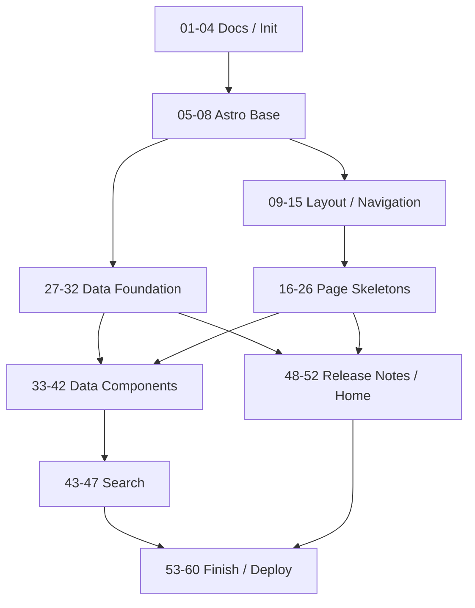

# ネオン・アンダーレルムTRPG ルールサイト開発計画

## 前提

- 初期開発対象は静的ルールサイト本体とする。
- GMガイド、シナリオ、キャラクターシート、アクセス解析、ダイスローラー等は初期実装に含めない。
- 各branchは原則として単独でbuild可能・review可能な状態でmergeする。
- branch名は `NN-purpose` 形式を基本とする。
- Excel本体は `.raw/` 配下でローカル管理し、Git管理しない。
- Git管理するのは、Markdown/MDX本文、サイトコード、変換済みJSON、仕様ドキュメントとする。

---

## Phase 0: リポジトリ初期化

- [x] `01-docs-requirements` — 要件定義ドキュメントを配置する
  - [x] `docs/requirements.md` を配置
  - [x] `docs/out-of-scope.md` を配置
  - [x] 初期スコープ外項目を明示

- [x] `02-init-astro-project` — Astro + TypeScript プロジェクトを初期化する
  - [x] Astroプロジェクト作成
  - [x] `package.json` 作成
  - [x] `tsconfig.json` 作成
  - [x] `npm run build` が通る状態にする

- [x] `03-gitignore-raw-policy` — `.raw/` と生成データ管理方針を追加する
  - [x] `.raw/` を `.gitignore` に追加
  - [x] `*.xlsx`, `*.xlsm`, `~$*.xlsx` を `.gitignore` に追加
  - [x] `data/generated/` を作成
  - [x] `data/generated/README.md` に手編集禁止方針を書く

- [x] `04-basic-project-docs` — READMEと開発手順の初期版を作成する
  - [x] `README.md` 作成
  - [x] `docs/deployment.md` 作成
  - [x] `docs/content-writing-guide.md` 作成
  - [x] 初期開発・ビルド手順を記載

---

## Phase 1: Astro基盤

- [x] `05-config-mdx` — MDX対応を追加する
  - [x] Astro MDX integration を追加
  - [x] `.mdx` ページの表示を確認
  - [x] MDX内Component埋め込み方針を確認

- [x] `06-config-base-path` — GitHub Pagesサブパス対応を追加する
  - [x] `astro.config.mjs` に `site` / `base` 設定を追加
  - [x] base path helper を用意
  - [x] 内部リンク・画像パスがサブパスで壊れない方針を作る

- [x] `07-0-prepare-design-review` — Visual Review基盤を準備する
  - [x] Visual Review用skillを追加
  - [x] design正本とVisual Review成果物の配置方針を定義
  - [x] package.jsonにVisual Review用scriptと必要最小限の依存関係を追加
  - [x] `.tmp/*.md` と `review-to-issue` との責務分離を明記
  - [x] 既存ドキュメントに必要であれば対応方針を追記

- [x] `07-global-styles` — CSS基盤を追加する
  - [x] `src/styles/tokens.css` 作成
  - [x] `src/styles/global.css` 作成
  - [x] `src/styles/prose.css` 作成
  - [x] 基本文字組み・本文幅・背景・色トークンを定義

- [x] `08-seo-component` — SEO/OGP Componentを作成する
  - [x] `src/components/seo/Seo.astro` 作成
  - [x] 共通OGP設定を実装
  - [x] `title`, `description`, `og:*` を設定可能にする
  - [x] 共通OGP画像の参照パスをbase path対応にする

---

## Phase 2: レイアウト・ナビゲーション

- [ ] `09-base-layout` — 共通Layoutを作成する
  - [ ] designを生成する
  - [ ] `src/layouts/BaseLayout.astro` 作成
  - [ ] `src/layouts/ContentLayout.astro` 作成
  - [ ] ヘッダー・本文・フッターの基本構造を作成

- [ ] `10-header-footer` — Header / Footerを実装する
  - [ ] designを生成する
  - [ ] `Header.astro` 作成
  - [ ] `Footer.astro` 作成
  - [ ] コピーライトを表示
  - [ ] クレジット、GitHub、X、Discordリンク枠をアイコンで表示
  - [ ] アイコンリンクに `aria-label` を設定

- [ ] `11-site-menu` — PC左サイトメニューを実装する
  - [ ] designを生成する
  - [ ] `src/lib/site/menu.ts` 作成
  - [ ] `SiteMenu.astro` 作成
  - [ ] PC版で左サイドに常設表示

- [ ] `12-mobile-menu` — スマホ用開閉メニューを実装する
  - [ ] designを生成する
  - [ ] `MobileMenu.astro` 作成
  - [ ] ヘッダーのボタンで開閉
  - [ ] メニュー項目選択後に閉じる
  - [ ] Escキーで閉じられることが望ましい

- [ ] `13-page-toc` — PC右ページ内目次を実装する
  - [ ] designを生成する
  - [ ] `PageToc.astro` 作成
  - [ ] ページ見出しから目次を生成
  - [ ] PC版では右サイドに固定表示
  - [ ] 見出しリンクでページ内ジャンプ可能にする

- [ ] `14-mobile-page-toc` — スマホ用ページ内目次を実装する
  - [ ] designを生成する
  - [ ] `MobilePageToc.astro` 作成
  - [ ] 「このページの目次」をワンタッチで開ける
  - [ ] 項目選択で該当見出しへジャンプ
  - [ ] サイトメニューとは導線を分離

- [ ] `15-current-menu-highlight` — 現在ページハイライトを実装する
  - [ ] designを生成する
  - [ ] 現在ページをサイトメニューで視覚的に識別
  - [ ] 親カテゴリを展開または強調
  - [ ] `aria-current="page"` を設定できるようにする

---

## Phase 3: コンテンツページ骨組み

- [ ] `16-page-home-skeleton` — トップページ骨組みを作成する
  - [ ] designを生成する
  - [ ] `/` を作成
  - [ ] キャッチコピー枠を作成
  - [ ] タイトルロゴ枠を作成
  - [ ] 最新リリースノート5件枠を作成
  - [ ] 簡単な説明枠を作成
  - [ ] クレジット枠を作成

- [ ] `17-page-introduction` — はじめにページを追加する
  - [ ] `/introduction.mdx` 作成
  - [ ] 仮本文・主要見出しを配置

- [ ] `18-page-world` — ワールドガイドページを追加する
  - [ ] `/world.mdx` 作成
  - [ ] 仮本文・主要見出しを配置

- [ ] `19-page-character-making` — キャラクターメイキングページを追加する
  - [ ] `/character-making.mdx` 作成
  - [ ] 仮本文・主要見出しを配置

- [ ] `20-page-rules` — ルールトップを追加する
  - [ ] `/rules/index.mdx` 作成
  - [ ] ゴールデンルール、判定、達成値、効果値、対抗判定の見出しを配置

- [ ] `21-page-scenario-play` — シナリオ進行ルールを追加する
  - [ ] `/rules/scenario-play.mdx` 作成
  - [ ] シーン、情報収集、休息、終了処理の見出しを配置

- [ ] `22-page-battle` — 戦闘ルールを追加する
  - [ ] `/rules/battle.mdx` 作成
  - [ ] 攻撃、リアクション、コンボ、掛け合い等の見出しを配置

- [ ] `23-page-advancement` — 成長ページを追加する
  - [ ] `/advancement.mdx` 作成
  - [ ] キャラクター成長の仮本文・主要見出しを配置

- [ ] `24-page-data-index` — データトップを追加する
  - [ ] `/data/index.mdx` 作成
  - [ ] スキルの見方、タイミング、コスト、制限の見出しを配置

- [ ] `25-page-items-index` — アイテムトップを追加する
  - [ ] `/data/items/index.mdx` 作成
  - [ ] アイテム種別説明の見出しを配置

- [ ] `26-page-404` — 404ページを追加する
  - [ ] designを生成する
  - [ ] `/404.astro` 作成
  - [ ] トップページへのリンクを表示
  - [ ] サイトメニューまたは検索への導線を表示

---

## Phase 4: データ基盤

- [ ] `27-data-schemas` — Zodスキーマを追加する
  - [ ] `src/lib/schemas/skill.ts` 作成
  - [ ] `src/lib/schemas/item.ts` 作成
  - [ ] `src/lib/schemas/ryugi.ts` 作成
  - [ ] `src/lib/schemas/ikizama.ts` 作成
  - [ ] `src/lib/schemas/releaseNote.ts` 作成

- [ ] `28-sample-generated-data` — 仮JSONデータを追加する
  - [ ] `data/generated/skills.json` 作成
  - [ ] `data/generated/items.json` 作成
  - [ ] `data/generated/ryugi.json` 作成
  - [ ] `data/generated/ikizama.json` 作成
  - [ ] `data/generated/release-notes.json` 作成

- [ ] `29-data-access-layer` — データ取得層を追加する
  - [ ] `src/lib/data/skills.ts` 作成
  - [ ] `src/lib/data/items.ts` 作成
  - [ ] `src/lib/data/ryugi.ts` 作成
  - [ ] `src/lib/data/ikizama.ts` 作成
  - [ ] `src/lib/data/releaseNotes.ts` 作成

- [ ] `30-validate-data-script` — JSON検証スクリプトを追加する
  - [ ] `scripts/validate-data.ts` 作成
  - [ ] Zodスキーマで生成JSONを検証
  - [ ] `npm run validate:data` を追加

- [ ] `31-excel-conversion-spec-stub` — Excel変換仕様の枠を追加する
  - [ ] `docs/excel-conversion-spec.md` 作成
  - [ ] 対象Excel、対象シート、列定義、ID生成ルールの記載枠を作る

- [ ] `32-excel-converter-stub` — Excel変換スクリプトの枠を追加する
  - [ ] `scripts/convert-excel.ts` 作成
  - [ ] `.raw/` 配下を読む想定にする
  - [ ] `npm run convert:data` を追加
  - [ ] 本格変換は実Excel確認後と明記

---

## Phase 5: データ表示UI

- [ ] `33-callout-component` — コールアウトComponentを追加する
  - [ ] designを生成する
  - [ ] `Callout.astro` 作成
  - [ ] `note`, `tip`, `warning`, `danger`, `example`, `version` を扱えるようにする

- [ ] `34-image-block-component` — 画像Componentを追加する
  - [ ] designを生成する
  - [ ] `ImageBlock.astro` 作成
  - [ ] `src`, `alt`, `caption` を指定可能にする
  - [ ] base path対応
  - [ ] `loading="lazy"` 対応

- [ ] `35-skill-card` — SkillCardを実装する
  - [ ] designを生成する
  - [ ] `SkillCard.astro` 作成
  - [ ] 名称、最大レベル、タイミング、コスト、技能、制限、効果を表示
  - [ ] 個別アンカーIDを付与

- [ ] `36-skill-list-legend` — SkillList / SkillLegendを実装する
  - [ ] designを生成する
  - [ ] `SkillList.astro` 作成
  - [ ] `SkillLegend.astro` 作成
  - [ ] ownerやcategoryでスキルを抽出表示

- [ ] `37-item-card` — ItemCardを実装する
  - [ ] designを生成する
  - [ ] `ItemCard.astro` 作成
  - [ ] アイテム種別ごとに必要項目を表示
  - [ ] 個別アンカーIDを付与

- [ ] `38-item-list-legend` — ItemList / ItemLegendを実装する
  - [ ] designを生成する
  - [ ] `ItemList.astro` 作成
  - [ ] `ItemLegend.astro` 作成
  - [ ] typeでアイテムを抽出表示

- [ ] `39-ryugi-pages` — 流儀一覧・詳細テンプレートを実装する
  - [ ] designを生成する
  - [ ] `/data/ryugi/index.astro` 作成
  - [ ] `/data/ryugi/[ryugiId].astro` 作成
  - [ ] 共通テンプレートから流儀ページを静的生成
  - [ ] 流儀スキル一覧を表示

- [ ] `40-ikizama-pages` — 生き様一覧・詳細テンプレートを実装する
  - [ ] designを生成する
  - [ ] `/data/ikizama/index.astro` 作成
  - [ ] `/data/ikizama/[ikizamaId].astro` 作成
  - [ ] 共通テンプレートから生き様ページを静的生成
  - [ ] 生き様スキル一覧・関連アイテムリンクを表示

- [ ] `41-item-category-pages` — アイテムカテゴリページを実装する
  - [ ] designを生成する
  - [ ] `/data/items/weapons.astro` 作成
  - [ ] `/data/items/armors.astro` 作成
  - [ ] `/data/items/omamori.astro` 作成
  - [ ] `/data/items/cybernetics.astro` 作成
  - [ ] `/data/items/nanomachines.astro` 作成
  - [ ] `/data/items/drugs.astro` 作成

- [ ] `42-data-card-anchors` — カード個別アンカーを確認・調整する
  - [ ] スキルカードへ直接ジャンプできる
  - [ ] アイテムカードへ直接ジャンプできる
  - [ ] 検索結果や本文リンクから利用可能なHTML構造にする

---

## Phase 6: 検索

- [ ] `43-install-pagefind` — Pagefindを導入する
  - [ ] Pagefind package追加
  - [ ] build後にindex生成できる
  - [ ] `npm run index:search` 追加

- [ ] `44-search-modal-ui` — 検索モーダルUIを作成する
  - [ ] designを生成する
  - [ ] `SearchButton.astro` 作成
  - [ ] `SearchModal.astro` 作成
  - [ ] 検索結果を同一画面内に表示する枠を作成

- [ ] `45-search-pagefind-integration` — Pagefind検索連携を実装する
  - [ ] 検索語入力でPagefind検索
  - [ ] 検索結果をモーダル内に表示
  - [ ] 結果クリックで該当ページまたはアンカーへ遷移

- [ ] `46-search-metadata` — 検索対象・除外・メタデータを調整する
  - [ ] ヘッダー、フッター、サイトメニュー、ページ内目次を検索対象から除外
  - [ ] ページタイトル、セクション、種別ラベルを検索結果に表示

- [ ] `47-search-mobile-behavior` — スマホ検索挙動を調整する
  - [ ] designを生成する
  - [ ] ヘッダー右側に検索アイコンを表示
  - [ ] 検索アイコンからポップアップ表示
  - [ ] 検索中に背景本文が不用意にスクロールしないよう調整

---

## Phase 7: トップ・リリースノート

- [ ] `48-release-note-schema` — リリースノートスキーマを追加する
  - [ ] `ReleaseNote` schemaを確定
  - [ ] `date`, `summary`, `body` を扱う

- [ ] `49-release-note-json` — 仮リリースノートJSONを追加する
  - [ ] `data/generated/release-notes.json` を作成
  - [ ] 更新日の降順表示に対応
  - [ ] `body` 空欄時のfallbackを確認

- [ ] `50-release-notes-page` — `/release-notes` を実装する
  - [ ] 全リリースノートを表示
  - [ ] 更新日と全文を表示
  - [ ] 全文が空欄なら簡単説明を表示
  - [ ] 改行を反映

- [ ] `51-home-release-notes` — トップ最新5件表示を実装する
  - [ ] `release-notes.json` から最新5件を取得
  - [ ] 更新日と簡単説明を表示
  - [ ] `/release-notes` へのリンクを表示

- [ ] `52-home-content-finalize` — トップ構成を整備する
  - [ ] designを生成する
  - [ ] ゲームキャッチコピーを表示
  - [ ] タイトルロゴを表示
  - [ ] ゲームの簡単な説明を表示
  - [ ] クレジットを表示
  - [ ] `/#credits` アンカーを設定

---

## Phase 8: 仕上げ・公開

- [ ] `53-accessibility-pass` — 最低限アクセシビリティを確認する
  - [ ] 画像altを確認
  - [ ] アイコンリンクのaria-labelを確認
  - [ ] メニュー・検索・目次のEsc挙動を確認
  - [ ] 見出し階層を確認
  - [ ] 色だけに依存した表現がないか確認

- [ ] `54-responsive-pass` — レスポンシブ調整を行う
  - [ ] 1024px以上のPCレイアウトを確認
  - [ ] 768px以上1024px未満の表示を確認
  - [ ] 768px未満のスマホレイアウトを確認
  - [ ] スマホヘッダーの下スクロール非表示・上スクロール表示を確認

- [ ] `55-performance-pass` — 軽量性を確認する
  - [ ] 不要なクライアントJSを削減
  - [ ] 画像lazy loadingを確認
  - [ ] カード一覧が過剰なクライアント描画に依存していないか確認
  - [ ] 大規模UIライブラリを導入していないことを確認

- [ ] `56-github-actions-deploy` — GitHub Actions公開設定を追加する
  - [ ] `.github/workflows/deploy.yml` 作成
  - [ ] `npm ci` 実行
  - [ ] `npm run check` 実行
  - [ ] `npm run build` / `npm run index:search` 実行
  - [ ] GitHub Pagesへdeploy

- [ ] `57-github-pages-base-check` — GitHub Pagesサブパス確認を行う
  - [ ] 内部リンク確認
  - [ ] 画像パス確認
  - [ ] CSS/JSパス確認
  - [ ] OGP画像URL確認
  - [ ] Pagefind検索ファイルパス確認

- [ ] `58-content-smoke-test` — 主要ページ表示確認を行う
  - [ ] 全ルートにアクセスできる
  - [ ] サイトメニューが機能する
  - [ ] ページ内目次が機能する
  - [ ] 検索が機能する
  - [ ] スキル/アイテムカードが表示される
  - [ ] 流儀/生き様テンプレートページが表示される

- [ ] `59-release-docs` — 公開手順ドキュメントを整備する
  - [ ] `docs/deployment.md` 更新
  - [ ] `README.md` 更新
  - [ ] ローカル開発、データ変換、検証、公開手順を記載

- [ ] `60-initial-release` — 初期公開用最終調整を行う
  - [ ] 初期リリースノートを追加
  - [ ] version tag または初期release名を決定
  - [ ] 初期公開前の最終build確認

---

## 初期スコープ外として維持するもの

- [ ] GMガイドは実装しない
- [ ] シナリオ本文は実装しない
- [ ] キャンペーン管理機能は実装しない
- [ ] キャラクター作成ウィザードは実装しない
- [ ] Webキャラクターシートは実装しない
- [ ] ダイスローラーは実装しない
- [ ] 戦闘シミュレーターは実装しない
- [ ] CMSは実装しない
- [ ] ログイン・認証は実装しない
- [ ] コメント・投稿機能は実装しない
- [ ] DBは導入しない
- [ ] サーバーサイド処理は導入しない
- [ ] 外部検索サービス連携は導入しない
- [ ] PDF自動生成は実装しない
- [ ] PWA対応は実装しない
- [ ] 多言語対応は実装しない
- [ ] 高度な画像最適化は実装しない
- [ ] 高度な一覧フィルタは実装しない
- [ ] 用語集専用ページは実装しない
- [ ] パンくずリストは実装しない
- [ ] ページ末尾の前後ナビゲーションは実装しない
- [ ] ページ内目次の現在位置ハイライトは初期必須にしない
- [ ] 個別OGP画像生成は実装しない
- [ ] 高度なアニメーションは実装しない
- [ ] 過剰なUIライブラリは導入しない

---

## Mermaid依存関係図

