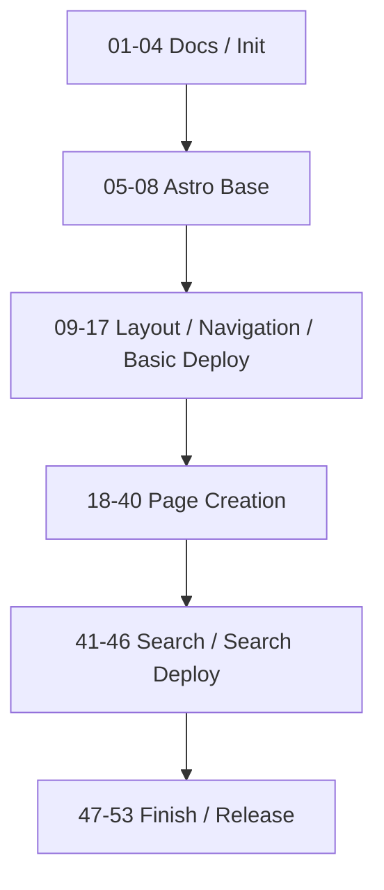

# ネオン・アンダーレルムTRPG ルールサイト開発計画

## 前提

* 初期開発対象は静的ルールサイト本体とする。
* GMガイド、シナリオ、キャラクターシート、アクセス解析、ダイスローラー等は初期実装に含めない。
* 各branchは原則として単独でbuild可能・review可能な状態でmergeする。
* branch名は `NN-purpose` 形式を基本とする。
* Excel本体は `.raw/` 配下でローカル管理し、Git管理しない。
* Git管理するのは、Markdown/MDX本文、サイトコード、変換済みJSON、仕様ドキュメントとする。
* ページ作成フェーズでは、1画面ずつ「データ整備」「必要Component作成」「画面作成」「完成画面スクリーンショットによるdesign更新」まで完了させる。
* 対象ページがExcelから生成されるデータを要求する場合は、`NN-0` として対象ページに関連するデータ整備計画を追加する。
* 対象ページがExcelから生成されるデータを要求しない場合は、`NN-0` を追加しない。
* 対象ページで必要なComponentが、現在の計画ですでに独立計画として存在していた場合のみ、`NN-1` としてComponent作成計画を追加する。
* 対象ページで新規に独立Component計画が存在しない場合は、`NN-1` を追加しない。
* `NN-1` のComponent作成計画では、実装前にComponent単体のdesignを作成する。
* 対象ページの画面作成は `NN-2` とする。
* `NN-2` では、ユーザーがローカル作業領域の `.raw/contents/SLUG.md` に記載内容とコメント形式の画面デザイン指示書を配置する前提で画面を作成する。
* `.raw/contents/SLUG.md` はコミットしない作業入力であり、最終的な画面本文・UI構造のSSoTは `src/pages` 配下の `.mdx` または `.astro` とする。
* `NN-2` の最後に、完成画面のスクリーンショットをもとにdesign正本を更新する。

---

## Phase 0: リポジトリ初期化

* [x] `01-docs-requirements` — 要件定義ドキュメントを配置する

  * [x] `docs/requirements.md` を配置
  * [x] `docs/out-of-scope.md` を配置
  * [x] 初期スコープ外項目を明示

* [x] `02-init-astro-project` — Astro + TypeScript プロジェクトを初期化する

  * [x] Astroプロジェクト作成
  * [x] `package.json` 作成
  * [x] `tsconfig.json` 作成
  * [x] `npm run build` が通る状態にする

* [x] `03-gitignore-raw-policy` — `.raw/` と生成データ管理方針を追加する

  * [x] `.raw/` を `.gitignore` に追加
  * [x] `*.xlsx`, `*.xlsm`, `~$*.xlsx` を `.gitignore` に追加
  * [x] `data/generated/` を作成
  * [x] `data/generated/README.md` に手編集禁止方針を書く

* [x] `04-basic-project-docs` — READMEと開発手順の初期版を作成する

  * [x] `README.md` 作成
  * [x] `docs/deployment.md` 作成
  * [x] `docs/content-writing-guide.md` 作成
  * [x] 初期開発・ビルド手順を記載

---

## Phase 1: Astro基盤

* [x] `05-config-mdx` — MDX対応を追加する

  * [x] Astro MDX integration を追加
  * [x] `.mdx` ページの表示を確認
  * [x] MDX内Component埋め込み方針を確認

* [x] `06-config-base-path` — GitHub Pagesサブパス対応を追加する

  * [x] `astro.config.mjs` に `site` / `base` 設定を追加
  * [x] base path helper を用意
  * [x] 内部リンク・画像パスがサブパスで壊れない方針を作る

* [x] `07-0-prepare-design-review` — Visual Review基盤を準備する

  * [x] Visual Review用skillを追加
  * [x] design正本とVisual Review成果物の配置方針を定義
  * [x] package.jsonにVisual Review用scriptと必要最小限の依存関係を追加
  * [x] `.tmp/*.md` と `review-to-issue` との責務分離を明記
  * [x] 既存ドキュメントに必要であれば対応方針を追記

* [x] `07-global-styles` — CSS基盤を追加する

  * [x] `src/styles/tokens.css` 作成
  * [x] `src/styles/global.css` 作成
  * [x] `src/styles/prose.css` 作成
  * [x] 基本文字組み・本文幅・背景・色トークンを定義

* [x] `08-seo-component` — SEO/OGP Componentを作成する

  * [x] `src/components/seo/Seo.astro` 作成
  * [x] 共通OGP設定を実装
  * [x] `title`, `description`, `og:*` を設定可能にする
  * [x] 共通OGP画像の参照パスをbase path対応にする

---

## Phase 2: レイアウト・ナビゲーション

* [x] `09-base-layout` — 共通Layoutを作成する

  * [x] designを生成する
  * [x] `src/layouts/BaseLayout.astro` 作成
  * [x] `src/layouts/ContentLayout.astro` 作成
  * [x] ヘッダー・本文・フッターの基本構造を作成

* [x] `10-header-footer` — Header / Footerを実装する

  * [x] designを生成する
  * [x] `Header.astro` 作成
  * [x] `Footer.astro` 作成
  * [x] コピーライトを表示
  * [x] GitHub、X、Discordリンク枠をアイコンで表示
  * [x] アイコンリンクに `aria-label` を設定

* [x] `11-site-menu` — PC左サイトメニューを実装する

  * [x] designを生成する
  * [x] `src/lib/site/menu.ts` 作成
  * [x] `SiteMenu.astro` 作成
  * [x] PC版で左サイドに常設表示

* [x] `12-mobile-menu` — スマホ用開閉メニューを実装する

  * [x] designを生成する
  * [x] 既存 `SiteMenu.astro` をスマホdrawerで再利用
  * [x] ヘッダーのボタンで開閉
  * [x] メニュー項目選択後に閉じる
  * [x] Escキーで閉じられることが望ましい

* [x] `12-1-site-menu-layout-copy` — サイトメニューの文言と階層レイアウトを調整する

  * [x] `サイトメニュー` 表示文言を削除またはより適切な文言へ変更
  * [x] 子項目開閉トグルを項目左側ではなく右端へ移動
  * [x] トグル用スペースでリンク群の左側が空きすぎないよう、全体を左寄せに調整
  * [x] PC左サイトメニューとスマホdrawer内メニューの両方で表示を確認

* [x] `13-page-toc` — PC右ページ内目次を実装する

  * [x] designを生成する
  * [x] `PageToc.astro` 作成
  * [x] ページ見出しから目次を生成
  * [x] PC版では右サイドに固定表示
  * [x] 見出しリンクでページ内ジャンプ可能にする
  * [x] Layout propsでページ内目次の表示/非表示を制御可能にする
  * [x] MDX frontmatterでページ内目次の表示/非表示を制御可能にする
  * [x] トップページ、更新履歴ページ、404ページではページ内目次を表示しない
  * [x] MDX / Markdown / Astro / データ生成ページを最終HTMLベースで統一的にTOC生成する
  * [x] build後postprocessでTOC対象見出しにアンカーIDを自動付与する
  * [x] 日本語見出し本文をそのままアンカーIDにしない
  * [x] ASCII-onlyのhash形式アンカーIDを生成する
  * [x] 自動生成IDにページ内出現順の連番を含めない
  * [x] 自動生成IDが同一ページ内で衝突した場合はbuild時に検出する
  * [x] 重複見出しは黙ってsuffix付与せず、必要に応じて `data-anchor-id` で明示解決する
  * [x] ユーザー承認済み追加仕様として、表示制御要件とアンカーID生成方針を `docs/requirements.md` に反映する

* [x] `14-mobile-page-toc` — スマホ用ページ内目次を実装する

  * [x] designを生成する
  * [x] `MobilePageToc.astro` 作成
  * [x] 「このページの目次」をワンタッチで開ける
  * [x] 項目選択で該当見出しへジャンプ
  * [x] サイトメニューとは導線を分離

* [x] `15-current-menu-highlight` — 現在ページハイライトを実装する

  * [x] designを生成する
  * [x] 現在ページをサイトメニューで視覚的に識別
  * [x] 親カテゴリを展開または強調
  * [x] `aria-current="page"` を設定できるようにする

* [x] `15-1-menu-expand-current-ancestors-only` — 現在ページに至る親カテゴリだけを初期展開する

  * [x] `defaultExpanded` 前提の初期展開をやめる
  * [x] 現在ページが子孫ページの場合のみancestor親カテゴリを初期展開する
  * [x] 親カテゴリ自身がcurrentの場合は子項目を初期展開しない
  * [x] PC左サイトメニューとスマホdrawer内サイトメニューで同じ初期展開ルールを使う
  * [x] `aria-expanded` と `hidden` の初期状態を展開状態と一致させる

* [ ] `16-layout-screenshot-design-refresh` — レイアウト一式を画面キャプチャベースのdesignに更新する

  * [ ] 実装済みレイアウト一式の画面キャプチャを取得する
  * [ ] PC、タブレット、スマホ幅の代表スクリーンショットを取得する
  * [ ] Header / Footer / SiteMenu / MobileMenu / PageToc / MobilePageToc / 現在ページハイライトの状態を確認する
  * [ ] 画面キャプチャをもとにdesign正本を更新する
  * [ ] design正本と実装の差分、未解決事項、後続で調整すべきUI課題を記録する
  * [ ] このタスクでは、design更新を主目的とし、追加の機能実装は行わない

* [ ] `17-github-actions-deploy-basic` — GitHub Actionsによる基本デプロイを追加する

  * [ ] `.github/workflows/deploy.yml` 作成
  * [ ] `npm ci` を実行する
  * [ ] `npm run check` を実行する
  * [ ] `npm run build` を実行する
  * [ ] GitHub Pagesへdeployする
  * [ ] この段階では検索index生成をCIに含めない
  * [ ] この段階では `npm run index:search` を実行しない
  * [ ] この段階では `npm run build:search` を実行しない
  * [ ] Excel本体なしでCI/CDビルドが成功することを確認する

---

## Phase 3: ページ作成

* [ ] `18-0-release-notes-data` — トップページ・更新履歴ページ用リリースノートデータを整備する

  * [ ] `docs/conversion/release-notes.md` にリリースノートデータ変換仕様を策定する
  * [ ] `ReleaseNote` 検証スキーマを策定する
  * [ ] リリースノートExcelから `data/generated/release-notes.json` を生成する変換スクリプトを策定する
  * [ ] トップページ最新5件表示と更新履歴ページ全件表示に必要なデータ取得処理を策定する
  * [ ] 変換スクリプトと検証スキーマのテストを追加する
  * [ ] 更新日降順、必須項目、改行保持、`body` 空欄時fallbackを検証する

* [ ] `18-1-common-image-block-component` — 共通画像Componentを作成する

  * [ ] Component designを作成する
  * [ ] `ImageBlock.astro` を作成する
  * [ ] タイトルロゴ画像を表示できるようにする
  * [ ] `src`, `alt`, `caption` を指定可能にする
  * [ ] base pathに対応する
  * [ ] `loading="lazy"` に対応する
  * [ ] トップページ以外の後続ページでも再利用できる共通Componentとして実装する
  * [ ] Markdown / MDX本文またはAstroページから利用できることを確認する

* [ ] `18-2-home-page` — トップページを作成する

  * [ ] designを生成する
  * [ ] `/` を作成する
  * [ ] `.raw/contents/home.md` の記載内容とコメント形式の画面デザイン指示書をもとに画面を作成する
  * [ ] キャッチコピー枠を作成する
  * [ ] タイトルロゴ枠を作成する
  * [ ] 最新リリースノート5件枠を作成する
  * [ ] 簡単な説明枠を作成する
  * [ ] クレジット枠を作成する
  * [ ] 完成画面のスクリーンショットを取得し、design正本を更新する

* [ ] `19-2-release-notes-page` — 更新履歴ページを作成する

  * [ ] designを生成する
  * [ ] `/release-notes` を作成する
  * [ ] `.raw/contents/release-notes.md` の記載内容とコメント形式の画面デザイン指示書をもとに画面を作成する
  * [ ] 全リリースノートを表示する
  * [ ] 更新日と全文を表示する
  * [ ] 全文が空欄なら簡単説明を表示する
  * [ ] 改行を反映する
  * [ ] ページ内目次は表示しない
  * [ ] 完成画面のスクリーンショットを取得し、design正本を更新する

* [ ] `20-1-common-callout-component` — 共通Callout Componentを作成する

  * [ ] Component designを作成する
  * [ ] `Callout.astro` を作成する
  * [ ] `note`, `tip`, `warning`, `danger`, `example`, `version` を扱えるようにする
  * [ ] 色だけに依存せず、見出し・ラベル・アイコン等でも種別を識別できるようにする
  * [ ] はじめにページ以外の後続ページでも再利用できる共通Componentとして実装する
  * [ ] Markdown / MDX本文から利用できることを確認する

* [ ] `20-2-introduction-page` — はじめにページを作成する

  * [ ] designを生成する
  * [ ] `/introduction.mdx` を作成する
  * [ ] `.raw/contents/introduction.md` の記載内容とコメント形式の画面デザイン指示書をもとに画面を作成する
  * [ ] ゲーム概要、必要なもの、基本用語、読み始める導線を配置する
  * [ ] 必要に応じてCalloutを配置する
  * [ ] 完成画面のスクリーンショットを取得し、design正本を更新する

* [ ] `21-2-world-page` — ワールドガイドページを作成する

  * [ ] designを生成する
  * [ ] `/world.mdx` を作成する
  * [ ] `.raw/contents/world.md` の記載内容とコメント形式の画面デザイン指示書をもとに画面を作成する
  * [ ] 初期公開範囲の世界観本文を配置する
  * [ ] GM専用情報、シナリオ本文、キャンペーン本文は配置しない
  * [ ] 必要に応じてImageBlockを配置する
  * [ ] 完成画面のスクリーンショットを取得し、design正本を更新する

* [ ] `22-2-character-making-page` — キャラクターメイキングページを作成する

  * [ ] designを生成する
  * [ ] `/character-making.mdx` を作成する
  * [ ] `.raw/contents/character-making.md` の記載内容とコメント形式の画面デザイン指示書をもとに画面を作成する
  * [ ] キャラクターメイキング手順の説明を配置する
  * [ ] データ参照導線を配置する
  * [ ] 自動計算、入力フォーム、保存機能は作らない
  * [ ] 完成画面のスクリーンショットを取得し、design正本を更新する

* [ ] `23-2-rules-page` — ルールトップページを作成する

  * [ ] designを生成する
  * [ ] `/rules/index.mdx` を作成する
  * [ ] `.raw/contents/rules.md` の記載内容とコメント形式の画面デザイン指示書をもとに画面を作成する
  * [ ] ゴールデンルール、判定、達成値、効果値、対抗判定、端数処理を配置する
  * [ ] 必要に応じてCalloutを配置する
  * [ ] 完成画面のスクリーンショットを取得し、design正本を更新する

* [ ] `24-2-scenario-play-page` — シナリオ進行ルールページを作成する

  * [ ] designを生成する
  * [ ] `/rules/scenario-play.mdx` を作成する
  * [ ] `.raw/contents/scenario-play.md` の記載内容とコメント形式の画面デザイン指示書をもとに画面を作成する
  * [ ] シーン、情報収集、休息、シナリオ終了処理を配置する
  * [ ] シナリオ本文、ハンドアウト本文、キャンペーン本文は配置しない
  * [ ] 完成画面のスクリーンショットを取得し、design正本を更新する

* [ ] `25-2-battle-page` — 戦闘ルールページを作成する

  * [ ] designを生成する
  * [ ] `/rules/battle.mdx` を作成する
  * [ ] `.raw/contents/battle.md` の記載内容とコメント形式の画面デザイン指示書をもとに画面を作成する
  * [ ] 攻撃、リアクション、コンボ、掛け合い等を配置する
  * [ ] 戦闘処理支援ツール、ダイスローラー、戦闘シミュレーターは作らない
  * [ ] 必要に応じてCalloutやImageBlockを配置する
  * [ ] 完成画面のスクリーンショットを取得し、design正本を更新する

* [ ] `26-2-advancement-page` — 成長ページを作成する

  * [ ] designを生成する
  * [ ] `/advancement.mdx` を作成する
  * [ ] `.raw/contents/advancement.md` の記載内容とコメント形式の画面デザイン指示書をもとに画面を作成する
  * [ ] キャラクター成長に関する本文を配置する
  * [ ] 必要に応じてCalloutを配置する
  * [ ] 完成画面のスクリーンショットを取得し、design正本を更新する

* [ ] `27-1-skill-card-component` — SkillCard Componentを作成する

  * [ ] Component designを作成する
  * [ ] `SkillCard.astro` を作成する
  * [ ] 名称、最大レベル、タイミング、コスト、技能、制限、効果を表示する
  * [ ] カテゴリ、所属流儀または所属生き様を表示できるようにする
  * [ ] 個別アンカーIDを付与できるようにする
  * [ ] 通常のスキル表示だけでなく、凡例用データを渡して凡例としても表示できるようにする

* [ ] `27-2-data-index-page` — データトップページを作成する

  * [ ] designを生成する
  * [ ] `/data/index.mdx` を作成する
  * [ ] `.raw/contents/data.md` の記載内容とコメント形式の画面デザイン指示書をもとに画面を作成する
  * [ ] スキルの見方、データ項目、タイミング、コスト、制限などを配置する
  * [ ] SkillCardに凡例用データを渡す形でスキル凡例を表示する
  * [ ] アイテム凡例は各個別アイテムページ側で、それぞれのItem系Cardに凡例用データを渡して表示する
  * [ ] 完成画面のスクリーンショットを取得し、design正本を更新する

* [ ] `28-0-common-skills-data` — 共通スキル一覧ページ用データを整備する

  * [ ] `docs/conversion/common-skills.md` に共通スキル一覧用のデータ変換仕様を策定する
  * [ ] `Skill` 検証スキーマを策定する
  * [ ] スキルExcelから共通スキルを生成する変換スクリプトを策定する
  * [ ] 共通スキル一覧ページに必要なデータ取得処理を策定する
  * [ ] 変換スクリプトと検証スキーマのテストを追加する
  * [ ] 必須項目、ID重複、カテゴリ値、タイミング表記を検証する

* [ ] `28-1-common-skills-components` — 共通スキル一覧ページ用Componentを作成する

  * [ ] Component designを作成する
  * [ ] `SkillList.astro` を作成する
  * [ ] SkillListは受け取ったスキルデータ配列をSkillCardへ渡して一覧表示する
  * [ ] SkillCardと表示仕様を重複実装しない
  * [ ] 個別アンカーIDを利用できる構造にする

* [ ] `28-2-common-skills-page` — 共通スキル一覧ページを作成する

  * [ ] designを生成する
  * [ ] `/data/common-skills` ページを作成する
  * [ ] `.raw/contents/common-skills.md` の記載内容とコメント形式の画面デザイン指示書をもとに画面を作成する
  * [ ] 共通スキル一覧データを表示する
  * [ ] SkillList / SkillCard の表示方針と整合させる
  * [ ] 完成画面のスクリーンショットを取得し、design正本を更新する

* [ ] `29-0-ryugi-index-data` — 流儀一覧ページ用データを整備する

  * [ ] `docs/conversion/ryugi-index.md` に流儀一覧用のデータ変換仕様を策定する
  * [ ] `Ryugi` 検証スキーマを策定する
  * [ ] 流儀Excelから流儀一覧データを生成する変換スクリプトを策定する
  * [ ] 流儀一覧ページに必要なデータ取得処理を策定する
  * [ ] 変換スクリプトと検証スキーマのテストを追加する
  * [ ] 必須項目、ID重複、表示順を検証する

* [ ] `29-2-ryugi-index-page` — 流儀一覧ページを作成する

  * [ ] designを生成する
  * [ ] `/data/ryugi/index.astro` を作成する
  * [ ] `.raw/contents/ryugi-index.md` の記載内容とコメント形式の画面デザイン指示書をもとに画面を作成する
  * [ ] 流儀一覧を表示する
  * [ ] 各流儀詳細ページへの導線を配置する
  * [ ] 完成画面のスクリーンショットを取得し、design正本を更新する

* [ ] `30-0-ryugi-detail-data` — 流儀詳細ページ用データを整備する

  * [ ] `docs/conversion/ryugi-detail.md` に流儀詳細ページ用のデータ変換仕様を策定する
  * [ ] `Ryugi` と `Skill` の関連検証スキーマを策定する
  * [ ] 流儀詳細ページで流儀情報と流儀スキルを取得できる変換・取得処理を策定する
  * [ ] 変換スクリプトと検証スキーマのテストを追加する
  * [ ] 所属流儀ID、スキルID、個別アンカーIDの整合性を検証する

* [ ] `30-2-ryugi-detail-page` — 流儀詳細ページを作成する

  * [ ] designを生成する
  * [ ] `/data/ryugi/[ryugiId].astro` を作成する
  * [ ] `.raw/contents/ryugi-detail.md` の記載内容とコメント形式の画面デザイン指示書をもとに画面を作成する
  * [ ] 共通テンプレートから流儀詳細ページを静的生成する
  * [ ] 流儀説明、基礎能力値、プライマリボーナス、共通スキルボーナス、流儀スキル一覧を表示する
  * [ ] 個別流儀ごとのページファイルを複製しない
  * [ ] 完成画面のスクリーンショットを取得し、design正本を更新する

* [ ] `31-0-ikizama-index-data` — 生き様一覧ページ用データを整備する

  * [ ] `docs/conversion/ikizama-index.md` に生き様一覧用のデータ変換仕様を策定する
  * [ ] `Ikizama` 検証スキーマを策定する
  * [ ] 生き様Excelから生き様一覧データを生成する変換スクリプトを策定する
  * [ ] 生き様一覧ページに必要なデータ取得処理を策定する
  * [ ] 変換スクリプトと検証スキーマのテストを追加する
  * [ ] 必須項目、ID重複、表示順を検証する

* [ ] `31-2-ikizama-index-page` — 生き様一覧ページを作成する

  * [ ] designを生成する
  * [ ] `/data/ikizama/index.astro` を作成する
  * [ ] `.raw/contents/ikizama-index.md` の記載内容とコメント形式の画面デザイン指示書をもとに画面を作成する
  * [ ] 生き様一覧を表示する
  * [ ] 各生き様詳細ページへの導線を配置する
  * [ ] 完成画面のスクリーンショットを取得し、design正本を更新する

* [ ] `32-0-ikizama-detail-data` — 生き様詳細ページ用データを整備する

  * [ ] `docs/conversion/ikizama-detail.md` に生き様詳細ページ用のデータ変換仕様を策定する
  * [ ] `Ikizama`、`Skill`、`Item` の関連検証スキーマを策定する
  * [ ] 生き様詳細ページで生き様情報、生き様スキル、関連アイテムを取得できる変換・取得処理を策定する
  * [ ] 変換スクリプトと検証スキーマのテストを追加する
  * [ ] 生き様ID、スキルID、関連アイテムID、個別アンカーIDの整合性を検証する

* [ ] `32-2-ikizama-detail-page` — 生き様詳細ページを作成する

  * [ ] designを生成する
  * [ ] `/data/ikizama/[ikizamaId].astro` を作成する
  * [ ] `.raw/contents/ikizama-detail.md` の記載内容とコメント形式の画面デザイン指示書をもとに画面を作成する
  * [ ] 共通テンプレートから生き様詳細ページを静的生成する
  * [ ] 生き様説明、専用ルール、生き様スキル一覧、関連アイテムリンクを表示する
  * [ ] 個別生き様ごとのページファイルを複製しない
  * [ ] 完成画面のスクリーンショットを取得し、design正本を更新する

* [ ] `33-2-items-index-page` — アイテムトップページを作成する

  * [ ] designを生成する
  * [ ] `/data/items/index.mdx` を作成する
  * [ ] `.raw/contents/items.md` の記載内容とコメント形式の画面デザイン指示書をもとに画面を作成する
  * [ ] アイテム種別説明を配置する
  * [ ] 武器、防具、お守り、サイバネ、ナノマシン、ドラッグへの導線を配置する
  * [ ] 完成画面のスクリーンショットを取得し、design正本を更新する

* [ ] `34-0-items-weapons-data` — 武器ページ用データを整備する

  * [ ] `docs/conversion/items-weapons.md` に武器データ変換仕様を策定する
  * [ ] `Item` / `Weapon` 検証スキーマを策定する
  * [ ] アイテムExcelから武器データを生成する変換スクリプトを策定する
  * [ ] 武器ページに必要なデータ取得処理を策定する
  * [ ] 変換スクリプトと検証スキーマのテストを追加する
  * [ ] 必須項目、ID重複、アイテム種別、武器固有項目を検証する

* [ ] `34-1-items-weapons-components` — 武器ページ用Componentを作成する

  * [ ] Component designを作成する
  * [ ] `WeaponCard.astro` を作成する
  * [ ] `WeaponList.astro` を作成する
  * [ ] 武器固有の項目を表示できるようにする
  * [ ] 通常の武器表示だけでなく、凡例用データを渡して凡例としても表示できるようにする
  * [ ] 個別アンカーIDを付与する

* [ ] `34-2-items-weapons-page` — 武器ページを作成する

  * [ ] designを生成する
  * [ ] `/data/items/weapons.astro` を作成する
  * [ ] `.raw/contents/items-weapons.md` の記載内容とコメント形式の画面デザイン指示書をもとに画面を作成する
  * [ ] 武器リストを凡例付きで表示する
  * [ ] WeaponList / WeaponCard の表示方針と整合させる
  * [ ] WeaponCardに凡例用データを渡す形で武器凡例を表示する
  * [ ] 完成画面のスクリーンショットを取得し、design正本を更新する

* [ ] `35-0-items-armors-data` — 防具ページ用データを整備する

  * [ ] `docs/conversion/items-armors.md` に防具データ変換仕様を策定する
  * [ ] `Item` / `Armor` 検証スキーマを策定する
  * [ ] アイテムExcelから防具データを生成する変換スクリプトを策定する
  * [ ] 防具ページに必要なデータ取得処理を策定する
  * [ ] 変換スクリプトと検証スキーマのテストを追加する
  * [ ] 必須項目、ID重複、アイテム種別、防具固有項目を検証する

* [ ] `35-1-items-armors-components` — 防具ページ用Componentを作成する

  * [ ] Component designを作成する
  * [ ] `ArmorCard.astro` を作成する
  * [ ] `ArmorList.astro` を作成する
  * [ ] 防具固有の項目を表示できるようにする
  * [ ] 通常の防具表示だけでなく、凡例用データを渡して凡例としても表示できるようにする
  * [ ] 個別アンカーIDを付与する

* [ ] `35-2-items-armors-page` — 防具ページを作成する

  * [ ] designを生成する
  * [ ] `/data/items/armors.astro` を作成する
  * [ ] `.raw/contents/items-armors.md` の記載内容とコメント形式の画面デザイン指示書をもとに画面を作成する
  * [ ] 防具リストを凡例付きで表示する
  * [ ] ArmorList / ArmorCard の表示方針と整合させる
  * [ ] ArmorCardに凡例用データを渡す形で防具凡例を表示する
  * [ ] 完成画面のスクリーンショットを取得し、design正本を更新する

* [ ] `36-0-items-omamori-data` — お守りページ用データを整備する

  * [ ] `docs/conversion/items-omamori.md` にお守りデータ変換仕様を策定する
  * [ ] `Item` / `Omamori` 検証スキーマを策定する
  * [ ] アイテムExcelからお守りデータを生成する変換スクリプトを策定する
  * [ ] お守りページに必要なデータ取得処理を策定する
  * [ ] 変換スクリプトと検証スキーマのテストを追加する
  * [ ] 必須項目、ID重複、アイテム種別、お守り固有項目を検証する

* [ ] `36-1-items-omamori-components` — お守りページ用Componentを作成する

  * [ ] Component designを作成する
  * [ ] `OmamoriCard.astro` を作成する
  * [ ] `OmamoriList.astro` を作成する
  * [ ] お守り固有の項目を表示できるようにする
  * [ ] 通常のお守り表示だけでなく、凡例用データを渡して凡例としても表示できるようにする
  * [ ] 個別アンカーIDを付与する

* [ ] `36-2-items-omamori-page` — お守りページを作成する

  * [ ] designを生成する
  * [ ] `/data/items/omamori.astro` を作成する
  * [ ] `.raw/contents/items-omamori.md` の記載内容とコメント形式の画面デザイン指示書をもとに画面を作成する
  * [ ] お守り一覧を凡例付きで表示する
  * [ ] OmamoriList / OmamoriCard の表示方針と整合させる
  * [ ] OmamoriCardに凡例用データを渡す形でお守り凡例を表示する
  * [ ] 完成画面のスクリーンショットを取得し、design正本を更新する

* [ ] `37-0-items-cybernetics-data` — サイバネページ用データを整備する

  * [ ] `docs/conversion/items-cybernetics.md` にサイバネデータ変換仕様を策定する
  * [ ] `Item` / `Cybernetic` 検証スキーマを策定する
  * [ ] アイテムExcelからサイバネデータを生成する変換スクリプトを策定する
  * [ ] サイバネページに必要なデータ取得処理を策定する
  * [ ] 変換スクリプトと検証スキーマのテストを追加する
  * [ ] 必須項目、ID重複、アイテム種別、部位、サイバネ固有項目を検証する

* [ ] `37-1-items-cybernetics-components` — サイバネページ用Componentを作成する

  * [ ] Component designを作成する
  * [ ] `CyberneticCard.astro` を作成する
  * [ ] `CyberneticList.astro` を作成する
  * [ ] サイバネ固有の項目を表示できるようにする
  * [ ] 通常のサイバネ表示だけでなく、凡例用データを渡して凡例としても表示できるようにする
  * [ ] 個別アンカーIDを付与する

* [ ] `37-2-items-cybernetics-page` — サイバネページを作成する

  * [ ] designを生成する
  * [ ] `/data/items/cybernetics.astro` を作成する
  * [ ] `.raw/contents/items-cybernetics.md` の記載内容とコメント形式の画面デザイン指示書をもとに画面を作成する
  * [ ] サイバネ一覧を凡例付きで表示する
  * [ ] CyberneticList / CyberneticCard の表示方針と整合させる
  * [ ] CyberneticCardに凡例用データを渡す形でサイバネ凡例を表示する
  * [ ] 完成画面のスクリーンショットを取得し、design正本を更新する

* [ ] `38-0-items-nanomachines-data` — ナノマシンページ用データを整備する

  * [ ] `docs/conversion/items-nanomachines.md` にナノマシンデータ変換仕様を策定する
  * [ ] `Item` / `Nanomachine` 検証スキーマを策定する
  * [ ] アイテムExcelからナノマシンデータを生成する変換スクリプトを策定する
  * [ ] ナノマシンページに必要なデータ取得処理を策定する
  * [ ] 変換スクリプトと検証スキーマのテストを追加する
  * [ ] 必須項目、ID重複、アイテム種別、部位、ナノマシン固有項目を検証する

* [ ] `38-1-items-nanomachines-components` — ナノマシンページ用Componentを作成する

  * [ ] Component designを作成する
  * [ ] `NanomachineCard.astro` を作成する
  * [ ] `NanomachineList.astro` を作成する
  * [ ] ナノマシン固有の項目を表示できるようにする
  * [ ] 通常のナノマシン表示だけでなく、凡例用データを渡して凡例としても表示できるようにする
  * [ ] 個別アンカーIDを付与する

* [ ] `38-2-items-nanomachines-page` — ナノマシンページを作成する

  * [ ] designを生成する
  * [ ] `/data/items/nanomachines.astro` を作成する
  * [ ] `.raw/contents/items-nanomachines.md` の記載内容とコメント形式の画面デザイン指示書をもとに画面を作成する
  * [ ] ナノマシン一覧を凡例付きで表示する
  * [ ] NanomachineList / NanomachineCard の表示方針と整合させる
  * [ ] NanomachineCardに凡例用データを渡す形でナノマシン凡例を表示する
  * [ ] 完成画面のスクリーンショットを取得し、design正本を更新する

* [ ] `39-0-items-drugs-data` — ドラッグページ用データを整備する

  * [ ] `docs/conversion/items-drugs.md` にドラッグデータ変換仕様を策定する
  * [ ] `Item` / `Drug` 検証スキーマを策定する
  * [ ] アイテムExcelからドラッグデータを生成する変換スクリプトを策定する
  * [ ] ドラッグページに必要なデータ取得処理を策定する
  * [ ] 変換スクリプトと検証スキーマのテストを追加する
  * [ ] 必須項目、ID重複、アイテム種別、タイミング、ドラッグ固有項目を検証する

* [ ] `39-1-items-drugs-components` — ドラッグページ用Componentを作成する

  * [ ] Component designを作成する
  * [ ] `DrugCard.astro` を作成する
  * [ ] `DrugList.astro` を作成する
  * [ ] ドラッグ固有の項目を表示できるようにする
  * [ ] 通常のドラッグ表示だけでなく、凡例用データを渡して凡例としても表示できるようにする
  * [ ] 個別アンカーIDを付与する

* [ ] `39-2-items-drugs-page` — ドラッグページを作成する

  * [ ] designを生成する
  * [ ] `/data/items/drugs.astro` を作成する
  * [ ] `.raw/contents/items-drugs.md` の記載内容とコメント形式の画面デザイン指示書をもとに画面を作成する
  * [ ] ドラッグ一覧を凡例付きで表示する
  * [ ] DrugList / DrugCard の表示方針と整合させる
  * [ ] DrugCardに凡例用データを渡す形でドラッグ凡例を表示する
  * [ ] 完成画面のスクリーンショットを取得し、design正本を更新する

* [ ] `40-2-404-page` — 404ページを作成する

  * [ ] designを生成する
  * [ ] `/404.astro` を作成する
  * [ ] `.raw/contents/404.md` の記載内容とコメント形式の画面デザイン指示書をもとに画面を作成する
  * [ ] ページが見つからない旨を表示する
  * [ ] トップページへのリンクを表示する
  * [ ] サイトメニューまたは検索への導線を表示する
  * [ ] ページ内目次は表示しない
  * [ ] 完成画面のスクリーンショットを取得し、design正本を更新する

---

## Phase 4: 検索

* [ ] `41-install-pagefind` — Pagefindを導入する

  * [ ] Pagefind package追加
  * [ ] build後にindex生成できる
  * [ ] `npm run index:search` 追加

* [ ] `42-search-modal-ui` — 検索モーダルUIを作成する

  * [ ] designを生成する
  * [ ] `SearchButton.astro` 作成
  * [ ] `SearchModal.astro` 作成
  * [ ] 検索結果を同一画面内に表示する枠を作成

* [ ] `43-search-pagefind-integration` — Pagefind検索連携を実装する

  * [ ] 検索語入力でPagefind検索
  * [ ] 検索結果をモーダル内に表示
  * [ ] 結果クリックで該当ページまたはアンカーへ遷移

* [ ] `44-search-metadata` — 検索対象・除外・メタデータを調整する

  * [ ] ヘッダー、フッター、サイトメニュー、ページ内目次を検索対象から除外
  * [ ] ページタイトル、セクション、種別ラベルを検索結果に表示
  * [ ] データカード個別アンカーが検索結果から利用できることを確認する

* [ ] `45-search-mobile-behavior` — スマホ検索挙動を調整する

  * [ ] designを生成する
  * [ ] ヘッダー右側に検索アイコンを表示
  * [ ] 検索アイコンからポップアップ表示
  * [ ] 検索中に背景本文が不用意にスクロールしないよう調整
  * [ ] Escまたは閉じる操作で検索UIを閉じられるようにする

* [ ] `46-search-index-ci-deploy` — CIを更新して検索index生成込みでデプロイする

  * [ ] `.github/workflows/deploy.yml` を更新する
  * [ ] `npm run check` を実行する
  * [ ] `npm run build` 後に `npm run index:search` を実行する
  * [ ] または `npm run build:search` に切り替える
  * [ ] Pagefind生成物がGitHub Pagesへdeployされる成果物に含まれることを確認する
  * [ ] 公開環境で検索UIがPagefind indexを参照できることを確認する
  * [ ] GitHub Pagesサブパス配下で検索indexのパスが壊れないことを確認する

---

## Phase 5: 仕上げ・公開

* [ ] `47-accessibility-pass` — 最低限アクセシビリティを確認する

  * [ ] 画像altを確認
  * [ ] アイコンリンクのaria-labelを確認
  * [ ] メニュー・検索・目次のEsc挙動を確認
  * [ ] 見出し階層を確認
  * [ ] 色だけに依存した表現がないか確認
  * [ ] タップ領域が極端に小さくないか確認

* [ ] `48-responsive-pass` — レスポンシブ調整を行う

  * [ ] 1024px以上のPCレイアウトを確認
  * [ ] 768px以上1024px未満の表示を確認
  * [ ] 768px未満のスマホレイアウトを確認
  * [ ] スマホヘッダーの下スクロール非表示・上スクロール表示を確認
  * [ ] サイトメニュー、ページ内目次、検索UIがスマホで混同されないことを確認

* [ ] `49-performance-pass` — 軽量性を確認する

  * [ ] 不要なクライアントJSを削減
  * [ ] 画像lazy loadingを確認
  * [ ] カード一覧が過剰なクライアント描画に依存していないか確認
  * [ ] 大規模UIライブラリを導入していないことを確認
  * [ ] 外部解析スクリプトを導入していないことを確認

* [ ] `50-github-pages-base-check` — GitHub Pagesサブパス確認を行う

  * [ ] 内部リンク確認
  * [ ] 画像パス確認
  * [ ] CSS/JSパス確認
  * [ ] OGP画像URL確認
  * [ ] Pagefind検索ファイルパス確認
  * [ ] スキルカード個別アンカーの遷移確認
  * [ ] 各アイテムカード個別アンカーの遷移確認
  * [ ] データカード個別アンカーがGitHub Pagesサブパス配下でも壊れないことを確認

* [ ] `51-content-smoke-test` — 主要ページ表示確認を行う

  * [ ] 全ルートにアクセスできる
  * [ ] サイトメニューが機能する
  * [ ] ページ内目次が機能する
  * [ ] 検索が機能する
  * [ ] トップページが表示される
  * [ ] 更新履歴ページが表示される
  * [ ] ルール本文ページが表示される
  * [ ] スキルカードが表示される
  * [ ] 各アイテム種別のカードが表示される
  * [ ] 流儀/生き様テンプレートページが表示される
  * [ ] スキルカードと各アイテムカードに個別アンカーIDが付与されていることを確認する
  * [ ] 本文内リンクまたは検索結果からデータカード個別アンカーへ遷移できることを確認する

* [ ] `52-release-docs` — 公開手順ドキュメントを整備する

  * [ ] `docs/deployment.md` 更新
  * [ ] `README.md` 更新
  * [ ] ローカル開発、データ変換、検証、公開手順を記載
  * [ ] Excel変換がローカル作業であり、CI/CDでは変換済みJSONを使うことを明記

* [ ] `53-initial-release` — 初期公開用最終調整を行う

  * [ ] 初期リリースノートを追加
  * [ ] version tag または初期release名を決定
  * [ ] 初期公開前の最終build確認
  * [ ] 初期スコープ外機能が混入していないことを確認

* [ ] `54-ci-non-main-branches` — main以外でdeployなしCIを回すためのテスト / CIを整備する

  * [ ] branch / pull_request向けのCI workflowをdeploy workflowと分離して作成する
  * [ ] `npm ci` を実行する
  * [ ] `npm run check` を実行する
  * [ ] `npm run build` を実行する
  * [ ] 必要なtestを実行する
  * [ ] GitHub Pages deployは行わない
  * [ ] main以外のbranch / PRで、deployなしに品質確認できることを確認する
  * [ ] docs-only更新、AGENTS / SKILL更新のみの場合にCIを走らせるかどうかの方針を明記する

---

## 初期スコープ外として維持するもの

* [ ] GMガイドは実装しない
* [ ] シナリオ本文は実装しない
* [ ] キャンペーン管理機能は実装しない
* [ ] キャラクター作成ウィザードは実装しない
* [ ] Webキャラクターシートは実装しない
* [ ] ダイスローラーは実装しない
* [ ] 戦闘シミュレーターは実装しない
* [ ] CMSは実装しない
* [ ] ログイン・認証は実装しない
* [ ] コメント・投稿機能は実装しない
* [ ] DBは導入しない
* [ ] サーバーサイド処理は導入しない
* [ ] 外部検索サービス連携は導入しない
* [ ] PDF自動生成は実装しない
* [ ] PWA対応は実装しない
* [ ] 多言語対応は実装しない
* [ ] 高度な画像最適化は実装しない
* [ ] 高度な一覧フィルタは実装しない
* [ ] 用語集専用ページは実装しない
* [ ] パンくずリストは実装しない
* [ ] ページ末尾の前後ナビゲーションは実装しない
* [ ] ページ内目次の現在位置ハイライトは初期必須にしない
* [ ] 個別OGP画像生成は実装しない
* [ ] 高度なアニメーションは実装しない
* [ ] 過剰なUIライブラリは導入しない

---

## Mermaid依存関係図

