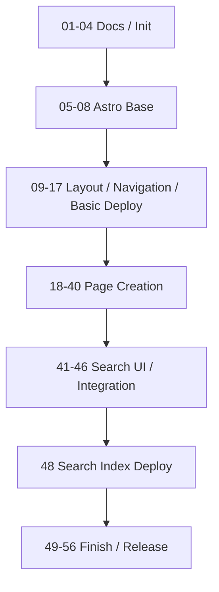

# ネオン・アンダーレルムTRPG ルールサイト開発計画

このファイルは、未完了・進行対象・直近で参照する計画を中心に管理するactive planである。

完了済み計画を退避する場合は、削除せず `docs/plan-done.md` へ移す。退避は、merge後のtracking更新またはユーザーの明示指示で行う。生成AIエージェントは、ユーザー指示なしに完了チェックやdone退避を行わない。

PR merge後の計画更新は `.agents/skills/post-merge-plan-update/SKILL.md` に従う。

## 前提

- 初期開発対象は静的ルールサイト本体とする。
- GMガイド、シナリオ、キャラクターシート、アクセス解析、ダイスローラー等は初期実装に含めない。
- 各branchは原則として単独でbuild可能・review可能な状態でmergeする。
- branch名は `NN-purpose` 形式を基本とする。
- Excel本体は `.raw/` 配下でローカル管理し、Git管理しない。
- Git管理するのは、Markdown/MDX本文、サイトコード、変換済みJSON、仕様ドキュメントとする。
- ページ作成フェーズでは、原則として1画面ずつ「データ整備」「必要Component作成」「画面作成」「完成画面スクリーンショットによるdesign更新」まで完了させる。複数ページで同じ入力データまたはComponentを共有する場合は、それらを先行する共通計画にまとめてよい。
- 対象ページがExcelから生成されるデータを要求する場合は、`NN-0` として対象ページまたは関連ページ群のデータ整備計画を追加する。
- 対象ページがExcelから生成されるデータを要求しない場合は、`NN-0` を追加しない。
- 対象ページで必要なComponentが、現在の計画ですでに独立計画として存在していた場合のみ、`NN-1` としてComponent作成計画を追加する。複数ページで共有するComponentは、最初の対象番号の共通計画にまとめてよい。
- 対象ページで新規に独立Component計画が存在しない場合は、`NN-1` を追加しない。
- `NN-1` のComponent作成計画では、実装前にComponent単体のdesignを作成する。
- 対象ページの画面作成は `NN-2` とする。
- `NN-2` では、ユーザーがローカル作業領域の `.raw/contents/SLUG.md` にfrontmatter、Markdown本文、HTMLコメント指示を含むcontents markdownを配置する前提で画面を作成する。
- contents markdownをGoogle Docs上に置く場合は、Markdownソースをプレーンテキストとして保持し、`text/plain` exportで `.raw/contents/*.md` に同期する。
- `.raw/contents/SLUG.md` はコミットしない作業入力である。対応ページでは、ユーザー編集のMarkdown本文とHTMLコメントを、ページ本文・可視の表示構成の正本とする。ユーザーの最新指示、および `AGENTS.md` と該当skill・ruleの安全・workflow規約を除き、issue、requirements、out-of-scope、plan、TODO、design、既存実装より優先する。
- `NN-2` の最後に、完成画面のスクリーンショットをもとにdesign正本を更新する。

---

## Phase 3: ページ作成

- [x] `27-2-data-index-page` — データトップページを作成する

  - [x] designを生成する
  - [x] `/data/index.mdx` を作成する
  - [x] `.raw/contents/data.md` のfrontmatter、Markdown本文、HTMLコメント指示をもとに画面を作成する
  - [x] スキルの見方、データ項目、タイミング、コスト、制限などを配置する
  - [x] SkillCardに凡例用データを渡す形でスキル凡例を表示する
  - [ ] アイテム凡例は各個別アイテムページ側で、それぞれのItem系Cardに凡例用データを渡して表示する
  - [x] 完成画面のスクリーンショットを取得し、design正本を更新する

- [ ] `34-0-items-data` — アイテムページ用データを整備する

  - [ ] `docs/conversion/items.md` にアイテムデータ変換仕様を策定する
  - [ ] `Item` と種別ごとのアイテム検証スキーマを策定する
  - [ ] アイテムExcelの各シートを個別の変換ロジックで変換する
  - [ ] 各シートの変換結果を1つのアイテムJSONに集約する
  - [ ] 静的ページと将来のクライアント側キャラクターシートの双方で利用できるデータ取得処理を策定する
  - [ ] 変換スクリプトと検証スキーマのテストを追加する
  - [ ] 必須項目、ID重複、アイテム種別、種別固有項目を検証する

- [ ] `34-1-item-card-components` — アイテム種別ごとのCardを整備する

  - [ ] Component designを作成する
  - [ ] `WeaponCard.astro`、`ArmorCard.astro`、`OmamoriCard.astro`、`CyberneticCard.astro`、`NanomachineCard.astro`、`DrugCard.astro` を作成する
  - [ ] 各Cardで共通項目と種別固有項目をPropsで表示できるようにする
  - [ ] `SkillCard` を含めてカードデザインを統一する
  - [ ] 各Cardの通常表示と凡例表示で共通利用するProps定義を整理する
  - [ ] `SkillCard` を含む凡例用Props定義を整理する
  - [ ] 各Cardに個別アンカーIDを付与する

- [ ] `34-2-items-weapons-page` — 武器ページを作成する

  - [ ] designを生成する
  - [ ] `/data/items/weapons.astro` を作成する
  - [ ] `.raw/contents/items-weapons.md` のfrontmatter、Markdown本文、HTMLコメント指示をもとに画面を作成する
  - [ ] 武器リストを凡例付きで表示する
  - [ ] CardContainer / WeaponCard の表示方針と整合させる
  - [ ] WeaponCardに凡例用データを渡す形で武器凡例を表示する
  - [ ] 完成画面のスクリーンショットを取得し、design正本を更新する

- [ ] `35-2-items-armors-page` — 防具ページを作成する

  - [ ] designを生成する
  - [ ] `/data/items/armors.astro` を作成する
  - [ ] `.raw/contents/items-armors.md` のfrontmatter、Markdown本文、HTMLコメント指示をもとに画面を作成する
  - [ ] 防具リストを凡例付きで表示する
  - [ ] CardContainer / ArmorCard の表示方針と整合させる
  - [ ] ArmorCardに凡例用データを渡す形で防具凡例を表示する
  - [ ] 完成画面のスクリーンショットを取得し、design正本を更新する

- [ ] `36-2-items-omamori-page` — お守りページを作成する

  - [ ] designを生成する
  - [ ] `/data/items/omamori.astro` を作成する
  - [ ] `.raw/contents/items-omamori.md` のfrontmatter、Markdown本文、HTMLコメント指示をもとに画面を作成する
  - [ ] お守り一覧を凡例付きで表示する
  - [ ] CardContainer / OmamoriCard の表示方針と整合させる
  - [ ] OmamoriCardに凡例用データを渡す形でお守り凡例を表示する
  - [ ] 完成画面のスクリーンショットを取得し、design正本を更新する

- [ ] `37-2-items-cybernetics-page` — サイバネページを作成する

  - [ ] designを生成する
  - [ ] `/data/items/cybernetics.astro` を作成する
  - [ ] `.raw/contents/items-cybernetics.md` のfrontmatter、Markdown本文、HTMLコメント指示をもとに画面を作成する
  - [ ] サイバネ一覧を凡例付きで表示する
  - [ ] CardContainer / CyberneticCard の表示方針と整合させる
  - [ ] CyberneticCardに凡例用データを渡す形でサイバネ凡例を表示する
  - [ ] 完成画面のスクリーンショットを取得し、design正本を更新する

- [ ] `38-2-items-nanomachines-page` — ナノマシンページを作成する

  - [ ] designを生成する
  - [ ] `/data/items/nanomachines.astro` を作成する
  - [ ] `.raw/contents/items-nanomachines.md` のfrontmatter、Markdown本文、HTMLコメント指示をもとに画面を作成する
  - [ ] ナノマシン一覧を凡例付きで表示する
  - [ ] CardContainer / NanomachineCard の表示方針と整合させる
  - [ ] NanomachineCardに凡例用データを渡す形でナノマシン凡例を表示する
  - [ ] 完成画面のスクリーンショットを取得し、design正本を更新する

- [ ] `39-2-items-drugs-page` — ドラッグページを作成する

  - [ ] designを生成する
  - [ ] `/data/items/drugs.astro` を作成する
  - [ ] `.raw/contents/items-drugs.md` のfrontmatter、Markdown本文、HTMLコメント指示をもとに画面を作成する
  - [ ] ドラッグ一覧を凡例付きで表示する
  - [ ] CardContainer / DrugCard の表示方針と整合させる
  - [ ] DrugCardに凡例用データを渡す形でドラッグ凡例を表示する
  - [ ] 完成画面のスクリーンショットを取得し、design正本を更新する

- [ ] `40-2-404-page` — 404ページを作成する

  - [ ] designを生成する
  - [ ] `/404.astro` を作成する
  - [ ] `.raw/contents/404.md` のfrontmatter、Markdown本文、HTMLコメント指示をもとに画面を作成する
  - [ ] ページが見つからない旨を表示する
  - [ ] トップページへのリンクを表示する
  - [ ] サイトメニューまたは検索への導線を表示する
  - [ ] ページ内目次は表示しない
  - [ ] 完成画面のスクリーンショットを取得し、design正本を更新する

- [ ] `41-2-support-page` — オンラインセッションのサポートページを作成する

  - [ ] designを生成する
  - [ ] `/support.mdx` を作成する
  - [ ] `.raw/contents/support.md` のfrontmatter、Markdown本文、HTMLコメント指示をもとに画面を作成する
  - [ ] 本作で多数のダイスを使うことと、オンラインセッションを推奨することを案内する
  - [ ] オンラインセッションの準備と進め方を配置する
  - [ ] 特定ツールを必須にせず、Webキャラクターシート、ダイスローラー、戦闘支援は作らない
  - [ ] 完成画面のスクリーンショットを取得し、design正本を更新する

---

## Phase 5: 仕上げ・公開

- [ ] `49-accessibility-pass` — 最低限アクセシビリティを確認する

  - [ ] 画像altを確認
  - [ ] アイコンリンクのaria-labelを確認
  - [ ] メニュー・検索・目次のEsc挙動を確認
  - [ ] 見出し階層を確認
  - [ ] 色だけに依存した表現がないか確認
  - [ ] タップ領域が極端に小さくないか確認

- [ ] `50-responsive-pass` — レスポンシブ調整を行う

  - [ ] 1024px以上のPCレイアウトを確認
  - [ ] 768px以上1024px未満の表示を確認
  - [ ] 768px未満のスマホレイアウトを確認
  - [ ] スマホヘッダーの下スクロール非表示・上スクロール表示を確認
  - [ ] サイトメニュー、ページ内目次、検索UIがスマホで混同されないことを確認

- [ ] `50-1-vrt-css-regression-guards` — VRT導入時にレイアウトCSS回帰検知を追加する

  - [ ] VRTの実行方針、対象viewport、対象routeを定義する
  - [ ] mobile layoutで意図しない横スクロールが発生していないことを検知する
  - [ ] MobilePageToc sticky headingの背景透過を検知する
  - [ ] TOC非表示対象ページでPageToc / MobilePageTocが表示されないことを検知する
  - [ ] 現在のdesign正本化用スクリーンショット取得testと、将来のVRT検知責務を混同しない

- [ ] `51-performance-pass` — 軽量性を確認する

  - [ ] 不要なクライアントJSを削減
  - [ ] 画像lazy loadingを確認
  - [ ] カード一覧が過剰なクライアント描画に依存していないか確認
  - [ ] 大規模UIライブラリを導入していないことを確認
  - [ ] 外部解析スクリプトを導入していないことを確認

- [ ] `52-github-pages-base-check` — GitHub Pagesサブパス確認を行う

  - [ ] 内部リンク確認
  - [ ] 画像パス確認
  - [ ] CSS/JSパス確認
  - [ ] OGP画像URL確認
  - [ ] Pagefind検索ファイルパス確認
  - [ ] スキルカード個別アンカーの遷移確認
  - [ ] 各アイテムカード個別アンカーの遷移確認
  - [ ] データカード個別アンカーがGitHub Pagesサブパス配下でも壊れないことを確認

- [ ] `53-content-smoke-test` — 主要ページ表示確認を行う

  - [ ] 全ルートにアクセスできる
  - [ ] サイトメニューが機能する
  - [ ] ページ内目次が機能する
  - [ ] 検索が機能する
  - [ ] トップページが表示される
  - [ ] 更新履歴ページが表示される
  - [ ] ルール本文ページが表示される
  - [ ] スキルカードが表示される
  - [ ] 各アイテム種別のカードが表示される
  - [ ] 流儀/生き様テンプレートページが表示される
  - [ ] スキルカードと各アイテムカードに個別アンカーIDが付与されていることを確認する
  - [ ] 本文内リンクまたは検索結果からデータカード個別アンカーへ遷移できることを確認する

- [ ] `54-release-docs` — 公開手順ドキュメントを整備する

  - [ ] `docs/deployment.md` 更新
  - [ ] `README.md` 更新
  - [ ] ローカル開発、データ変換、検証、公開手順を記載
  - [ ] Excel変換がローカル作業であり、CI/CDでは変換済みJSONを使うことを明記

- [ ] `54-1-game-image-generation-policy` — ゲーム画像生成promptの利用方針を整備する

  - [ ] `docs/image-generation/base-prompt.md`を現行hero実績と将来の用途に合わせて改訂する
  - [ ] 画像固有prompt、公式ロゴ、in-world signage、overlay typographyの利用方針と承認手順を決定する
  - [ ] base promptをsampleとして使う範囲と、生成前に画像固有promptで必ず決める事項を記載する

- [ ] `55-initial-release` — 初期公開用最終調整を行う

  - [ ] 初期リリースノートを追加
  - [ ] version tag または初期release名を決定
  - [ ] 初期公開前の最終build確認
  - [ ] 初期スコープ外機能が混入していないことを確認

- [ ] `56-ci-non-main-branches` — main以外でdeployなしCIを回すためのテスト / CIを整備する

  - [ ] branch / pull_request向けのCI workflowをdeploy workflowと分離して作成する
  - [ ] `npm ci` を実行する
  - [ ] `npm run check` を実行する
  - [ ] `npm run build` を実行する
  - [ ] 必要なtestを実行する
  - [ ] GitHub Pages deployは行わない
  - [ ] main以外のbranch / PRで、deployなしに品質確認できることを確認する
  - [ ] docs-only更新、AGENTS / SKILL更新のみの場合にCIを走らせるかどうかの方針を明記する

---

## 初期スコープ外として維持するもの

- [ ] GMガイドは実装しない

- [ ] シナリオ本文は実装しない

- [ ] キャンペーン管理機能は実装しない

- [ ] キャラクター作成ウィザードは実装しない

- [ ] Webキャラクターシートは実装しない

- [ ] ダイスローラーは実装しない

- [ ] 戦闘シミュレーターは実装しない

- [ ] CMSは実装しない

- [ ] ログイン・認証は実装しない

- [ ] コメント・投稿機能は実装しない

- [ ] DBは導入しない

- [ ] サーバーサイド処理は導入しない

- [ ] 外部検索サービス連携は導入しない

- [ ] PDF自動生成は実装しない

- [ ] PWA対応は実装しない

- [ ] 多言語対応は実装しない

- [ ] 高度な画像最適化は実装しない

- [ ] 高度な一覧フィルタは実装しない

- [ ] 用語集専用ページは実装しない

- [ ] パンくずリストは実装しない

- [ ] ページ末尾の前後ナビゲーションは実装しない

- [ ] ページ内目次の現在位置ハイライトは初期必須にしない

- [ ] 個別OGP画像生成は実装しない

- [ ] 高度なアニメーションは実装しない

- [ ] 過剰なUIライブラリは導入しない

---

## Mermaid依存関係図

