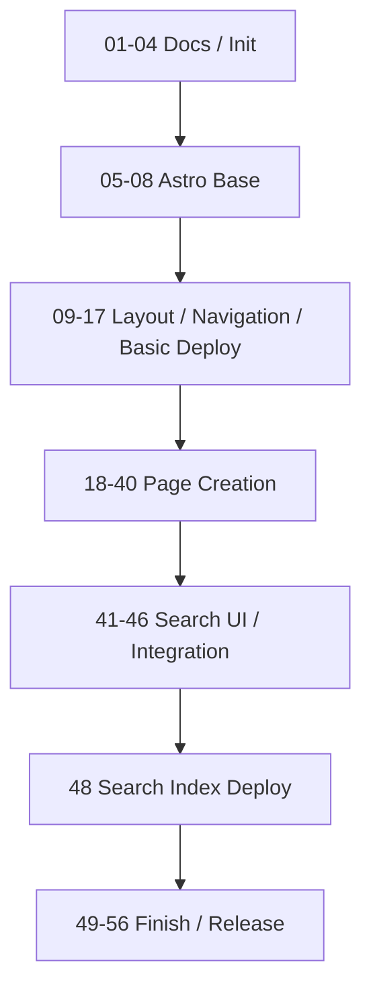

# ネオン・アンダーレルムTRPG ルールサイト開発計画

このファイルは、未完了・進行対象・直近で参照する計画を中心に管理するactive planである。

完了済み計画を退避する場合は、削除せず `docs/plan-done.md` へ移す。退避は、merge後のtracking更新またはユーザーの明示指示で行う。生成AIエージェントは、ユーザー指示なしに完了チェックやdone退避を行わない。

PR merge後の計画更新は `.agents/skills/post-merge-plan-update/SKILL.md` に従う。

## 前提

- 初期開発対象は静的ルールサイト本体とする。
- GMガイド、シナリオ、ダイスローラー等は初期実装に含めない。Webキャラクターシートは `ex-02-web-character-sheet`、Cloudflare Web Analyticsは `ex-05-access-analytics` に限り初期実装に含める。
- 各branchは原則として単独でbuild可能・review可能な状態でmergeする。
- branch名は `NN-purpose` 形式を基本とする。`ex-NN-purpose` は、ユーザーが特別taskとして指定した場合に限り使用する。
- 1st stepの目的は、ルールサイト公開の初回告知を見た人がなるべく長くサイトを読み、「遊んでみたい」と思えることとする。完了は、初回告知時点でPLが遊ぶ判断と参加準備をするために十分なコンテンツが公開されている状態と定義する。
- Excel本体は `.raw/` 配下でローカル管理し、Git管理しない。
- Git管理するのは、Markdown/MDX本文、サイトコード、変換済みJSON、仕様ドキュメントとする。
- ページ作成フェーズでは、原則として1画面ずつ「データ整備」「必要Component作成」「画面作成」「design intentとVRT対象の確認」「対象VRTの比較」まで完了させる。複数ページで同じ入力データまたはComponentを共有する場合は、それらを先行する共通計画にまとめてよい。canonical baselineの初回作成・更新は、差分を確認したうえでユーザーが明示指示した場合だけ行う。
- 対象ページがExcelから生成されるデータを要求する場合は、`NN-0` として対象ページまたは関連ページ群のデータ整備計画を追加する。
- 対象ページがExcelから生成されるデータを要求しない場合は、`NN-0` を追加しない。
- 対象ページで必要なComponentが、現在の計画ですでに独立計画として存在していた場合のみ、`NN-1` としてComponent作成計画を追加する。複数ページで共有するComponentは、最初の対象番号の共通計画にまとめてよい。
- 対象ページで新規に独立Component計画が存在しない場合は、`NN-1` を追加しない。
- `NN-1` のComponent作成計画では、実装前にComponent単体のdesignを作成する。
- 対象ページの画面作成は `NN-2` とする。
- `NN-2` では、必要に応じてユーザーがローカル作業領域の `.raw/contents/SLUG.md` にfrontmatter、Markdown本文、HTMLコメント指示を含むcontents markdownを手動で配置できる。
- `.raw/contents/SLUG.md` はコミットしない補助入力である。ページ本文・可視の表示構成のGit管理上の正本はMDX / Astroとし、contentsは最新のユーザー指示がない限りそれらやissue、requirements、designを上書きしない。
- `NN-2` の最後に、対象VRTを比較する。design intent、route、状態、viewport、snapshot名は`docs/design/<target>/notes.md`へ記録する。canonical baselineの初回作成・更新は、差分を確認したうえでユーザーが明示指示した場合だけ行う。

---

## Phase 5: 仕上げ・公開

- [ ] `54-release-docs` — 公開手順ドキュメントを整備する

  - [ ] `docs/deployment.md` 更新
  - [ ] `README.md` 更新
  - [ ] ローカル開発、データ変換、検証、公開手順を記載
  - [ ] Excel変換がローカル作業であり、CI/CDでは変換済みJSONを使うことを明記

- [ ] `54-1-game-image-generation-policy` — ゲーム画像生成promptの利用方針を整備する

  - [ ] `docs/image-generation/base-prompt.md`を現行hero実績と将来の用途に合わせて改訂する
  - [ ] 画像固有prompt、公式ロゴ、in-world signage、overlay typographyの利用方針と承認手順を決定する
  - [ ] base promptをsampleとして使う範囲と、生成前に画像固有promptで必ず決める事項を記載する

---

## 初期スコープ外として維持するもの

- [ ] GMガイドは実装しない

- [ ] シナリオ本文は実装しない

- [ ] キャンペーン管理機能は実装しない

- [ ] キャラクター作成ウィザードは実装しない

- [ ] ダイスローラーは実装しない

- [ ] 戦闘シミュレーターは実装しない

- [ ] CMSは実装しない

- [ ] ログイン・認証は実装しない

- [ ] コメント・投稿機能は実装しない

- [ ] DBは導入しない

- [ ] サーバーサイド処理は導入しない

- [ ] 外部検索サービス連携は導入しない

- [ ] PDF自動生成は実装しない

- [ ] PWA対応は実装しない

- [ ] 多言語対応は実装しない

- [ ] 高度な画像最適化は実装しない

- [ ] 高度な一覧フィルタは実装しない

- [ ] 用語集専用ページは実装しない

- [ ] パンくずリストは実装しない

- [ ] ページ内目次の現在位置ハイライトは初期必須にしない

- [ ] 個別OGP画像生成は実装しない

- [ ] 高度なアニメーションは実装しない

- [ ] 過剰なUIライブラリは導入しない

---

## Mermaid依存関係図

```mermaid id="pl5m29"
flowchart TD
  A[01-04 Docs / Init] --> B[05-08 Astro Base]
  B --> C[09-17 Layout / Navigation / Basic Deploy]
  C --> D[18-40 Page Creation]
  D --> E[41-46 Search UI / Integration]
  E --> F[48 Search Index Deploy]
  F --> G[49-56 Finish / Release]
```
